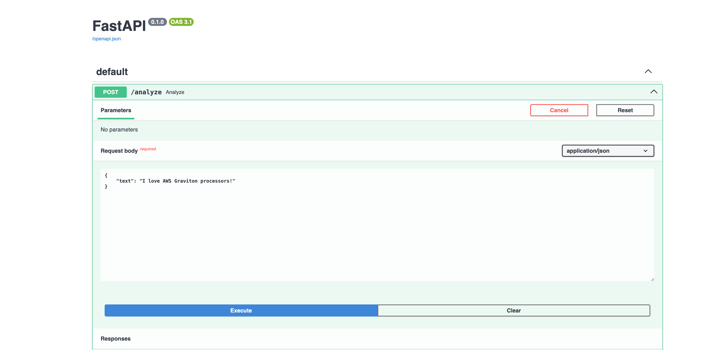
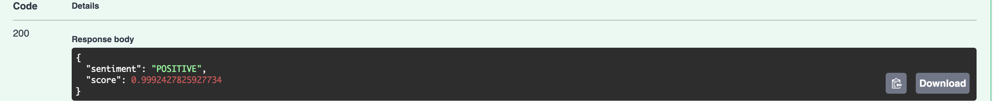

# Sentiment Analysis API

This is a lightweight REST API for performing sentiment analysis on text input using a pre-trained machine learning model from the Transformers library.

The API classifies the sentiment of the provided text as `Positive`, `Negative`, or `Neutral`, and returns a confidence score for the prediction.

## Requirements
- Python 3.8+

## Dependencies
- `fastapi`
- `uvicorn`
- `transformers`
- `torch`

## Installation

### Clone the Repository
```bash
git clone <repository-url>
cd sentiment-analysis-app

## Set Up a Virtual Environment
python3 -m venv env
source env/bin/activate
```

### Install Dependencies
```
# pip install -r requirements.txt

- Start the API Server Run the server locally using Uvicorn:
# uvicorn app.main:app --host 0.0.0.0 --port 8000
```

### Access the API

Once the server is running, you can interact with the API at:

 - `Swagger UI: http://127.0.0.1:8000/docs` 
 - `API Root Endpoint: http://127.0.0.1:8000/analyze`

## Send a JSON payload with the text to analyze:
```
{
    "text": "I love AWS Graviton processors!"
}
```




### Response
The API returns the sentiment label and confidence score:

```
{
    "sentiment": "POSITIVE",
    "score": 0.9998
}
```




### Example Inputs
- Positive Sentiment: "I love this product! It's amazing."
- Negative Sentiment: "This service is terrible and disappointing."
- Neutral Sentiment: "The weather is fine today."


